# 在Mac下开发C语言

## 前言

在mooc上的讨论区收到不少同学问怎么在自己的Mac上写C语言，Dev、CFree也基本上都是Windows下的。本文将介绍如何在Mac上开发C语言<br>
在Mac下开发C语言有两种方式，一种是命令行的gcc，一种是IDE式的Xcode。重点介绍前者，因为前者为命令行，并且在写和编译前还有一些事情需要去做。后者比较庞大，仅仅用来写C有点高射炮打蚊子的意思，最主要是有界面，只需要记得几个单词就可以使用了

## 先决条件
阅读gcc部分前，我假定你已经有最基础的[Shell使用本领](https://github.com/m4XEp1/Epis-Knowledge-Repo/tree/master/Terminal%20Tutorial)<br>
下面开始介绍两个工具的安装和使用

## gcc

gcc是一个命令行工具，Mac虽然是基于Unix但不是自带的，就Minimal版的Linux一样，需要额外的安装<br>
接下来就介绍安装方法<br>
如果嫌长、没耐心、没兴趣的话，请直接往下看[Xcode](https://github.com/m4XEp1/Epis-Knowledge-Repo/blob/master/Install%20gcc%20on%20Mac/README.md#xcode)部分

### 试一波运气
```shell
$ gcc
```
如果弹窗显示要安装，那就点击安装，这样是最方便的<br>
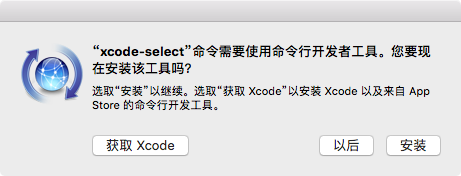<br>

### 如果没弹窗
```shell
$ xcode-select --install
```
如果还没弹窗，那应该得一步一步来了

### 1 of 3 - 安装Git
首先，到Git的[官网](https://git-scm.com)下载Git，页面的右边有一个`Download for Mac`，点击之后会打开一个新的页面，会开始下载。如果没有，可以点击`click here to download manually`，会跳转到SourceForge的页面，就会开始下载了<br>
网络不好的话可能需要等待一段时间<br>
下载结束后，打开dmg镜像，里面会有一个箱子打开的图标，按下键盘的`control`键后鼠标左键单击，松开，点击打开，会提示来自身份不明的开发者，点打开<br>
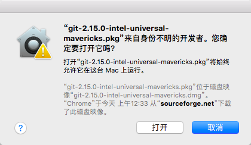<br>
接着过程中会让你输入密码验证，输入后过一会，安装就结束了<br>
到此，第一步就结束了

### 2 of 3 - 安装Homebrew
打开Homebrew的[官网](https://brew.sh/)，把`English`的下拉菜单选择为简体中文（你也可以直接访问[中文官网](https://brew.sh/index_zh-cn.html)），将`安装Homebrew`下方的命令复制<br>

粘贴到`终端`<br>
接着**执行**<br>
<br>
按下回车继续，然后输入你的密码<br>
过一会会出现`Downloading Command Line Tools`，这就需要等了，如果你的网络不好，会等很久<br>
等到终端等待我们输入下一条命令的时候，安装就是结束了

### 最后一步 - 安装 gcc
```shell
$ brew install gcc
```
网络良好的话，不用一分钟就结束了<br>
这时候我们可以直接敲gcc来试一下是否安装成功
```shell
$ gcc
```
只要不是`command not fount`，那就是完成了<br>
你也可以
```shell
$ gcc --version
```
查看当前版本

### 编译
```shell
$ gcc [filename]
```
上方的`[filename]`指的是你已经写好的文件名字，编译默认生成的结果是`a.out`<br>
你也可以指定生成的文件名字
```shell
$ gcc [filename] -o [filename]
```
选项`-o`的意思是 output ，-o 的后面跟上你想要的名字<br>
例子：
```shell
$ gcc 1.c  # 编译那个叫做1.c的文件
```
```shell
$ gcc 1.c -o hello 	# 编译那个叫做1.c的文件，并生成hello的可执行程序
```

### 执行
```shell
$ ./[filename]
```
例子：
```shell
$ ./hello
```

### 编辑
你可以下载[sublime](https://www.sublimetext.com/), [nodepad++](https://notepad-plus-plus.org/)，或者使用[nano](https://github.com/m4XEp1/Epis-Knowledge-Repo/blob/master/Terminal%20Tutorial/README.md#nano---%E5%91%BD%E4%BB%A4%E8%A1%8C%E4%B8%8B%E7%9A%84%E5%8F%AF%E8%A7%86%E5%8C%96%E7%BC%96%E8%BE%91%E5%99%A8)作为编辑器<br>
编辑完成后保存到你想要的位置，编译前cd过去或者直接带路径也可以<br>
尽量保存在用户目录下，这样方便找

## Xcode

### 安装

打开App Store，搜索`Xcode`<br>
途中一个带锤子的蓝颜色图标就是Xcode<br>
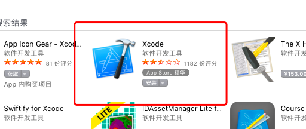<br>
点击安装，过程会有点久，足足有5个多G<br>
为什么不先写Xcode而是gcc呢，因为Xcode安装的时候会带上gcc，会影响安装的正确性和容错

### 使用
Mac的安装比较人性化，不像Win一样还要自己选择一大堆的设置<br>
打开你的Xcode，第一次会让你接受一个License，点击`Agree`<br>
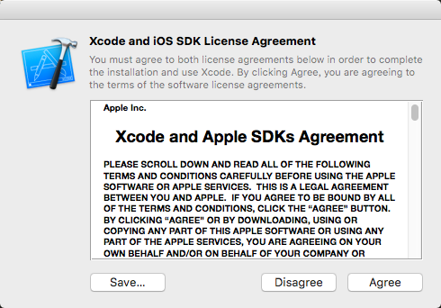<br>
之后输入你的用户密码<br>
接着会安装一些东西，等待<br>
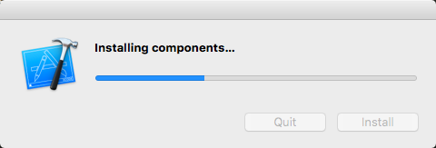<br>
完成后，会出来一个窗口<br>
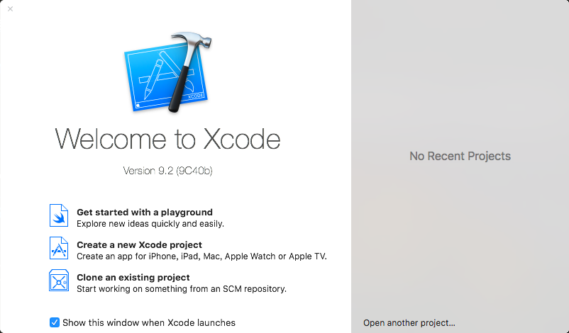<br>
我们选择`Creat a new Xcode project`<br>
接着会弹出一个标题为`Choose a template for your new project:`，标题的下面我们选择`macOS`，接着选择`Command Line Tool`，然后点击下方的`Next`<br>
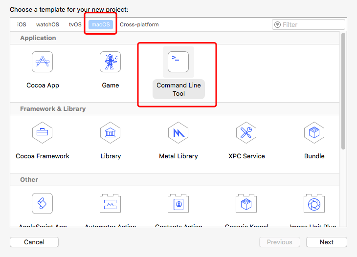<br>
在新出来的页面里，在`Product Name`设置你的项目名字，下方的`Language`下拉菜单里选择`C`，`Organization Identifier`里可以随便写个东西<br>
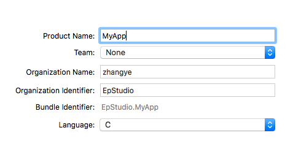<br>
上图的名字可以做个参考<br>
接着会问你存在哪，我建议是在用户目录下存一个文件夹专门放置你的Xcode项目，这样找代码也方便找。同时建议取消打勾`Creat Git repository on my Mac`，因为我们暂时用不到这个<br>
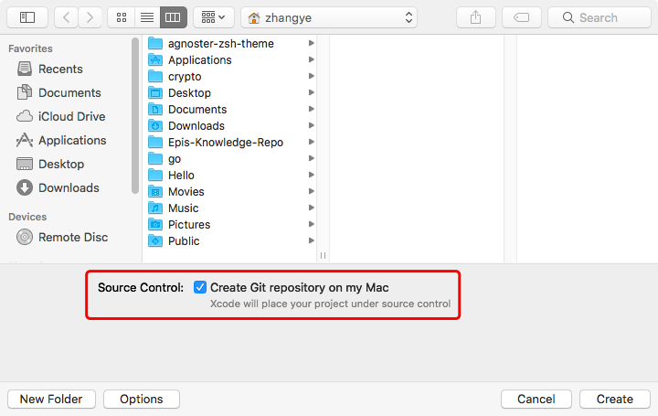<br>
点击`Create`，接着会出来Xcode的界面<br>
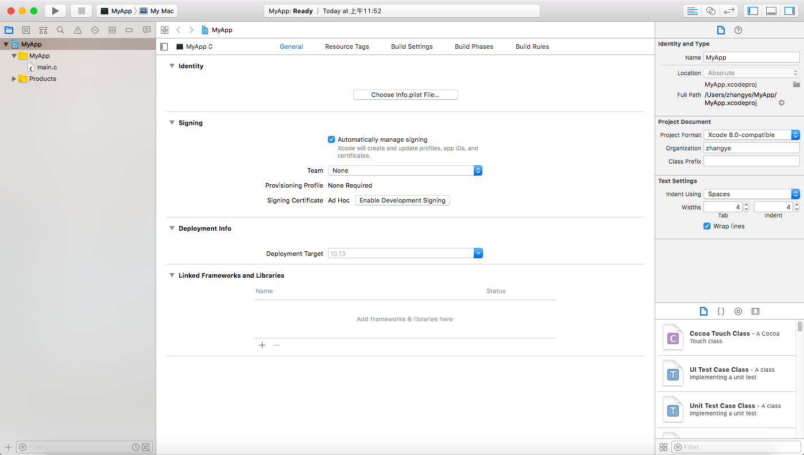<br>
左边是我们的项目文件，你可以看到一个叫做`main.c`的文件，单击它<br>
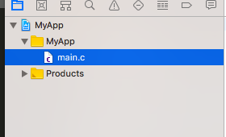<br>
编辑区就会显示文件的内容了，它默认给了个Hello World的输出，你可以开始写你想要的东西<br>
如果你觉得文字字体太小，按下键盘的`command` + `+`，就可以放大。你也可以在上方菜单栏的`Editor -> Font size -> Increase`<br>
写好之后，左上角有个播放的按键，单击它<br>
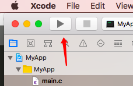<br>
第一次使用会问你是否打开开发者模式，点击`Enable`，输入你的密码<br>
<br>
如果代码没有写错的话，会弹出一个提示`Build Succeeded`，下方会有一个黑色的图标，单击它，就可以看到运行结果了<br>
<br>
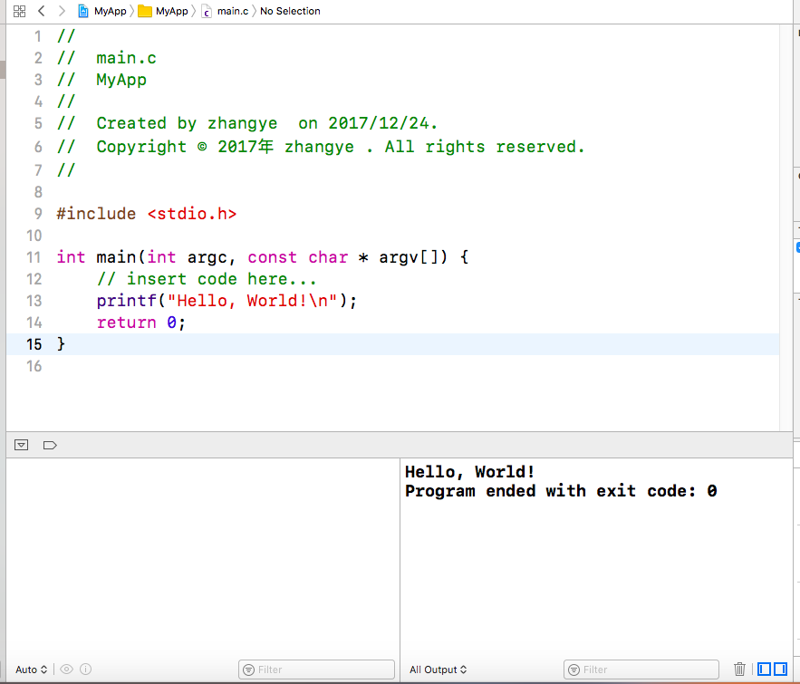<br>
右边的窗口为结果<br>
如果你写错代码了，会有提示<br>
<br>
如果你的程序需要输入，运行的时候在下方右边的窗口里输入就可以<br>


### 下次使用
如果你没有取消勾选欢迎界面下方的选项，在下次启动Xcode的时候窗口的右边会有你的项目，或者再新建一个，也是可以的

## 后记
写本文的时候的机子配置是Macbook Air 13' ，可能没法顾全安装中产生的任何问题。如果有遇到问题且本文没有讲到的，请给我提[issue](https://github.com/m4XEp1/Epis-Knowledge-Repo/issues/new)，谢谢