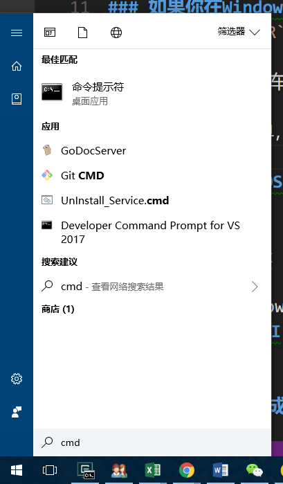
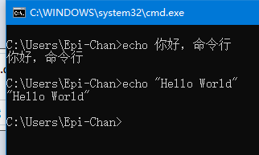
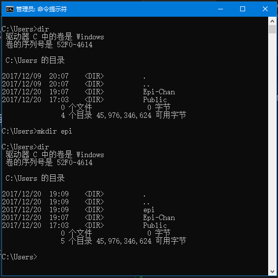

# Terminal Tutorial #

本文旨在介绍终端，命令行，以及常用命令

## 什么是命令行 ##

简要的来说，就是运行一类程序的环境。由于它的显示是一行一行的，所以我们把它叫做命令行

## 我怎样能找到它？ ##

### 如果你在Windows ###

使用 `Windows + R` 键，即可调出一个叫做运行的窗口<br>
<br>
然后输入`cmd`，回车<br>
或者，打开开始菜单，搜索框里输入cmd，找到命令提示符<br>
<br>

### 如果你在Mac OS ###
从桌面上进去Launch Pad<br>
<br>
找到终端，打开它<br>


### 如果你是Linux ###

#### 如果你有GUI ####

Ubuntu下按下Windows键，输入`Terminal`

#### 如果你没有GUI #### 

那就直接是命令行<br>
`GUI`的全称是`graphic user interface`，就是图形用户界面<br>
简单的来说，就是能用鼠标来操纵的系统

## 命令行界面的组成部分

### 路径
<br>
红线部分就是路径，意思是这个命令窗口当前所在的位置<br>
比如说，我们要运行某一个程序，如果不用快捷方式的话，就得过去他所在的那个文件夹，双击运行，对不对？那么命令行也是同理的

### 光标
和记事本、Word一样，光标所在的区域是让你输入命令的

## 我们用几个命令来入门CMD
其它系统平台请略过，往后看
### 第一个命令
``` batch
echo 你好，命令行 #井号后面为注释，不要输入
```
上方的阴影区域就是我们要输入进去的命令，其中由两个部分组成<br>
<br>
`echo`是我们要运行的程序，中间有一个空格，`你好，命令行`是我们给它的参数<br>
参数的意思是，我在程序启动的时候给了它一些东西，它会把这个东西拿去使用，比如在C语言里，我们读进一个数然后再输出，参数实际上是运行前就给它了<br>
敲完之后我们敲`回车`<br>
<br>
然后屏幕上出来了`你好，命令行`，这个是`程序的输出`<br>
你也可以<br>
``` batch
echo "Hello World"
```
在命令行程序里，给定参数的时候，如果参数中间有空格，用双引号把它包起来<br>


### 列出当前目录的东西
``` batch
dir
```
这个命令是列出当前路径下的所有`文件`和`文件夹`<br>
<br>
每一行中标了`<dir>`的为文件夹(diretory)

### 新建一个文件夹
``` batch
mkdir epi   #意思是在当前目录新建一个叫做epi的文件夹
```
这个命令是用来新建文件夹的，我们可以用`dir`来看创建的结果
<br>
`epi`只是我用来做实验的，当然你们可以自己起名字<br>
上图中我用`管理员权限`打开的，因为在C盘某些文件夹下新建文件夹等操作会涉及权限问题

### Goto Anywhere
既然涉及了路径，有的时候我们要去别的路径下，那么要使用`cd`命令，带我们过去
``` batch
cd epi  # 进入当前目录下那个叫做epi的文件夹
```
<br>
这时候我们就会看到，路径变了<br>
如果我们有一个文件夹的名字是`带了空格`的呢？那就加上双引号<br>
<br>
回到上一个文件夹怎么办呢？
``` batch
cd ..   # cd加上一个空格再写两个.
```
<br>
记得参数之间是有空格的<br>
如果你不想一直敲cd进入某个文件夹，你想一次进入，可以把地址复制下来<br>
<br>
```batch
cd [你所复制的内容]
```
然后就会快速的过去了<br>
<br>
我们的电脑硬盘一般都有几个分区，如果要切换，就敲那个`盘符`+`半角冒号`，如：
``` batch
D:  
```
<br>
这样就会去到D盘了<br>
操作上述那个复制路径的命令的前提是，盘符相同。如果不相同，先换所在分区再操作

### 运行目录下面的程序
假定我们现在有一个叫做`Hello.exe`的用C语言说Hello的程序，就在我们所在的目录下<br>
<br>
直接敲名字即可运行(也可以带上那个`.exe`)
``` batch
Hello
```
<br>
然后你会发现，不用加上`system("pause")`也不会闪退

### 清空屏幕上的文字
命令敲多了，命令窗口总会有一堆文字，我们需要清屏命令来清除它<br>
* Before<br>


``` batch
cls
```

* After<br>

<br>

### 打开某一个文本文件 ###

`more`命令会把参数所表示的文件的内容输出到屏幕上

``` batch
more 1.c
```


### 快速补全 ###

我们都知道，如果某一个命令又臭又长，敲起来会很难受<br>
假定我们还是那个`Hello World`文件夹<br>
<br>
`cd`时候敲一个`H`，接着按下键盘上的`Tab`键，也就是切换大写的上面那个，就会出现完整的"Hello World"<br>
当然，这里只敲一个H是因为目录下只有一个以H开头的文件/文件夹，如果有多的，就输入直到那个字母`仅有一个可配对`的为止

## 多种多样的终端 ##

除了Windows下的cmd，还有`git bash`，`cmder`，`ConEmu`之类的终端，大同小异<br>
就好比狗的品种有好几种，一个道理
